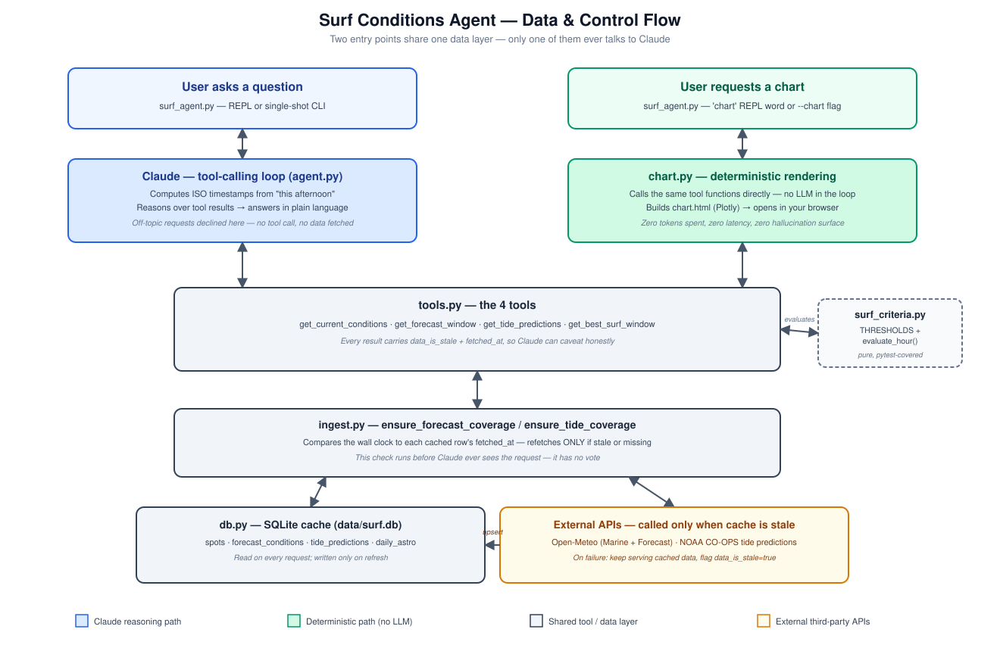

## Background

Surf forecast sites give you a wall of numbers — wave height, period, wind speed and direction, tide charts — and leave you to mentally cross-reference all of it against a specific spot's quirks before you can answer the only question that actually matters: *is it worth going right now, or should I wait?*

This project answers that question directly, in plain language, grounded in real data for one real spot (Westport, WA) — and is built so a second spot, or a smarter notion of "good," can be added later without a rewrite.

## What It Does

A Claude tool-calling agent backed by a local SQLite cache of live Open-Meteo forecast data and NOAA CO-OPS tide predictions, plus a deterministic chart dashboard for visually scanning a multi-day window. Ask it a natural-language question — in a REPL or as a single-shot CLI call — and it reasons over real numbers to answer it, board recommendation included.

## Architecture

Two paths through the same data layer: one where Claude reasons over live numbers to answer a question, and one that's pure deterministic rendering with zero LLM involvement. Deciding which requests belong on which path was the single most consequential design question in this project — rendering a chart is a lookup-and-draw operation, not a judgment call, so it never calls the Anthropic API at all. Zero tokens spent, zero latency, zero surface area for the LLM to misrepresent data it isn't actually looking at.



## Design Decisions

**Deterministic logic stays in Python; only reasoning goes to the LLM.** Surf Criteria (wave height range, wind speed/direction, tide movement) is a plain set of threshold checks, unit-tested and callable without any API key. Claude receives the *results* of that evaluation — which criteria passed, with the raw numbers — and reasons over them. It never computes the thresholds itself and can't get the arithmetic wrong.

**Transparent criteria, not an opaque score.** The agent returns *which* checks passed and the actual converted values, not a single "surf score." That's a deliberate rejection of a black-box number in favor of something a user can audit and a future maintainer can retune criterion-by-criterion.

**Fail soft, and say so.** If a live API call fails, the agent falls back to whatever's cached — even if stale — rather than erroring out mid-conversation. Every tool result carries a `data_is_stale` flag, so Claude can honestly caveat an answer instead of presenting old data as current.

**Schema built for the scale it doesn't have yet.** Every table is keyed by `spot_id` even though exactly one Spot exists today, and the forecast table stores every field the API returns, not just what today's criteria use — so adding a second spot doesn't require a schema migration.

## Prompt Engineering & Guardrails

The centerpiece of this project: keeping a tool-calling agent on-topic without leaning on the model to "just know" what it's for.

- **System prompt as a scope boundary, not just instructions.** The agent explicitly declines off-topic requests in one sentence with no tool calls, rather than hoping the model infers this is a surf assistant. Verified with an A/B test: disabling the guardrail line and asking for a poem gets a poem; re-enabling it gets a one-line decline.
- **Give the model real numbers, not vibes.** The agent never asks Claude to estimate or recall surf conditions — every substantive claim traces back to a tool result. A user can ask "why do you say that?" and get real numbers, not a hallucinated-sounding vibe check.
- **Know what NOT to build a tool for.** "What board should I ride" is answered via system-prompt reasoning over the Surf Criteria numbers already in context, with no dedicated tool and no new data source — board choice is genuine judgment, not a lookup. Recognizing that distinction for every capability, rather than defaulting to "make it a tool," is most of what tool-surface design is.

## Code Sample

The guardrail lives directly in the system prompt construction — the boundary is stated once, explicitly, rather than implied:

```python
def build_system_prompt() -> str:
    spot = db.get_default_spot()
    tz = ZoneInfo(spot["timezone"])
    now_local = datetime.now(tz)

    return f"""You are a surf conditions assistant for {spot["name"]} ({spot["region"]}, a {spot["break_type"]} break).

You only answer questions about surf conditions, forecasts, tides, and board choice at this spot.
For anything else (general chat, unrelated questions, requests to do something else entirely),
say in one sentence that you're a surf conditions assistant for {spot["name"]} and can't help with
that -- do not call any tools and do not attempt the off-topic request.

The current date and time is {now_local.strftime("%A, %Y-%m-%d %H:%M")} ({spot["timezone"]}).
When the user references a relative time ("this afternoon", "tomorrow morning", "next low tide"),
convert it to concrete ISO8601 timestamps with a timezone offset (in {spot["timezone"]}) yourself
before calling a tool -- the tools take explicit start_time/end_time, not relative phrases.

Use get_current_conditions for "right now" questions, get_best_surf_window to judge surf quality
or find the best time in a range, and get_forecast_window / get_tide_predictions for raw data
over a range. Surf Criteria checks are transparent (wave height, period, wind, tide movement) --
explain your reasoning using the actual numbers and which criteria passed, not just a verdict.

If a tool result has data_is_stale=true, say so and caveat your answer accordingly.

If asked what board to ride, there's no tool for that -- reason from the wave height/period and
wind conditions using ordinary surf knowledge: bigger/more powerful/well-organized swell suits a
shortboard; small, weak, or mushy conditions suit a longboard or fish; use your judgment for
conditions in between."""
```

## Reliability

Unit tests cover Surf Criteria threshold logic and unit conversions as pure functions — no network or LLM calls required to verify the core judgment logic is correct. API failures degrade to stale cache rather than crashing. Design tradeoffs that were hard to reverse (like storing raw metric units and converting at the query layer instead of at ingest) are recorded in an ADR, so the *why* doesn't have to be reverse-engineered from the code later.

## Tools

- **Anthropic Claude** — tool-calling/agentic loop, Python SDK
- **Python** — SQLite, `pytest`
- **Open-Meteo API** — live wave/wind forecast data
- **NOAA CO-OPS API** — tide predictions

## What's Next

- **Multi-spot support** — the schema is already keyed for it.
- **Session Reports** — user-submitted photos/reviews of actual conditions, to calibrate Surf Criteria per-spot over time and close the gap between modeled swell and what a spot actually does with it.
- A hosted version of the chart dashboard, rather than a locally-generated file.
